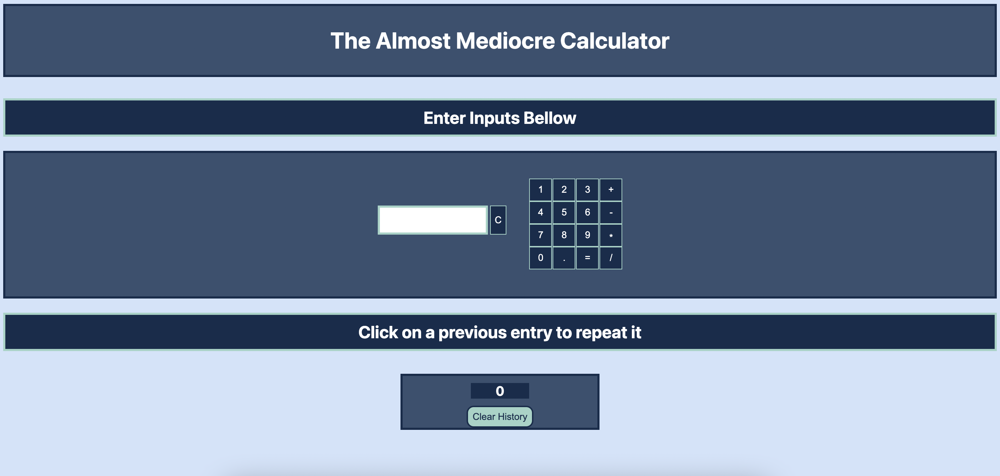

# Server Calculator

## Description

_Duration: 2 day Sprint_

This is a calculator capable of doing basic adition, subtraction, multiplication, and division. It's called a server calculator because all of the math logic is done on a server, and sent back to the client. When using the calculator, it will show you the most recent answer, and the history of all of equations. You can click on any past equation in the history in order to repeat it again. 

## Screen Shot

### Prerequisites

- [Node.js](https://nodejs.org/en/)

## Installation

1. Fork and clone this repo.
2. Import JQuery into your project.
3. Inside your terminal type `npm init --yes` and `npm install express`, to install Express.

## Usage

1. The application will only work when the server is running, so type `node "server-file-location"` into your terminal to start it.
2. Type localhost:5000 in your browser to open the app.

## Built With

- JQuery
- Node.js
- Express.js

## Acknowledgement
Thanks to [Prime Digital Academy](www.primeacademy.io) who equipped and helped me to make this application a reality. (Thank your people)

## Support
If you have suggestions or issues, please email me at [smrdelb@gmail.com](www.smrdelb@gmail.com)

